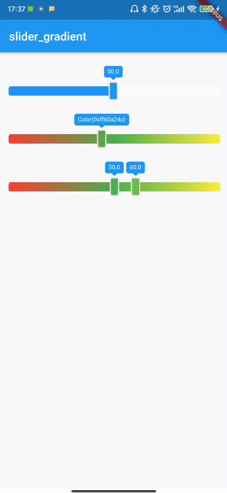

# slider_gradient

Slider with gradient background

## display

#### image

## Usage

| Name          | Type                 | Description                                                                                                                                                                                                                                                                                                                                                       | Default                                                                                   |
| ------------- | -------------------- | ----------------------------------------------------------------------------------------------------------------------------------------------------------------------------------------------------------------------------------------------------------------------------------------------------------------------------------------------------------------- | ----------------------------------------------------------------------------------------- |
| value         | int                  | Default value                                                                                                                                                                                                                                                                                                                                                     | Slider default minimum                                                                    |
| values        | List<double>         | isRange = true, values must be passed as a valid value and cannot be empty                                                                                                                                                                                                                                                                                        | -                                                                                         |
| isRange       | bool                 | whether to use the range                                                                                                                                                                                                                                                                                                                                          | false                                                                                     |
| min           | int                  | Slider minimum                                                                                                                                                                                                                                                                                                                                                    | 0                                                                                         |
| max           | int                  | Slider maximum                                                                                                                                                                                                                                                                                                                                                    | 100                                                                                       |
| isShowLabel   | bool                 | Show the label on the slider                                                                                                                                                                                                                                                                                                                                      | false                                                                                     |
| label         | String               | Label displays data. It is valid only when "isShowlabel" is true.                                                                                                                                                                                                                                                                                                 | null                                                                                      |
| isGradientBg  | bool                 | Whether the background color of the background slider is a gradient.                                                                                                                                                                                                                                                                                              | true                                                                                      |
| onChange      | SliderChangeCallback | A custom callback function that triggers as long as the slider moves                                                                                                                                                                                                                                                                                              | null                                                                                      |
| onChangeEnd   | SliderChangeCallback | A Custom callback function triggered by slider stop movement                                                                                                                                                                                                                                                                                                      | null                                                                                      |
| onChangeBegin | SliderChangeCallback | A Custom callback function triggered by slider start movement                                                                                                                                                                                                                                                                                                     | null                                                                                      |
| colors        | List< Color >        | Slider background gradient from left to right，When isgradientbg = true, it is the gradient color array. When isgradientbg = false, when it is not set, the main color of the slider is the current theme color of the system, and the auxiliary color is white. When colors is set, the main color is the first in the array and the auxiliary color is the last | There are two colors by default, the first app is the main color, and the second is white |
| labelStyle    | LabelStyle           | Custom label style                                                                                                                                                                                                                                                                                                                                                | this                                                                                      |
| sliderStyle   | SliderStyle          | slider label style                                                                                                                                                                                                                                                                                                                                                | this                                                                                      |
| thumbStyle    | ThumbStyle           | thumb label style                                                                                                                                                                                                                                                                                                                                                 | this                                                                                      |
